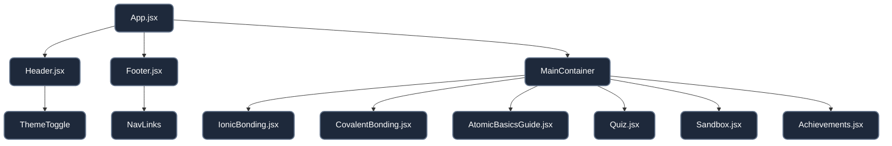

# ChemVista – Comprehensive Analysis

> **Purpose**: This document provides a detailed, single‑page walkthrough of the ChemVista application, focusing on its core *features* and how they are implemented. It includes visual diagrams (Mermaid) and UI screenshots to illustrate structure and design.

---

## 1. High‑Level Overview
- **Framework**: React (JSX) bundled with Vite.
- **Language**: JavaScript (ES6) + JSX, CSS modules.
- **Entry Point**: `src/main.jsx` mounts `<App />` into `#root`.
- **Root Component**: `src/App.jsx` – handles routing (via internal `activeTab` state), global theme (light/dark), and persistence using `localStorage`.
- **Styling**: Dark‑theme with glass‑morphism (CSS variables, backdrop‑filter, translucent cards).
- **State Persistence**: User progress, selected theme, and unlocked achievements are saved to `localStorage` on every state change and restored on app load.

---

## 2. Core Features
| Feature | Component | Description | Key Interactions |
|---|---|---|---|
| **Ionic Bonding Simulator** | `IonicBonding.jsx` | SVG‑based interactive representation of ionic bonds. Drag‑and‑drop ions, real‑time charge balance validation. | Drag ions → Snap to lattice → Validation feedback |
| **Covalent Bonding Simulator** | `CovalentBonding.jsx` | Shows covalent bond formation with orbital overlap visualisation. Users toggle bond order. | Click orbitals → Form single/double/triple bond → Score update |
| **Atomic Basics Guide** | `AtomicBasicsGuide.jsx` | Educational content about atomic structure, periodic table, electron configuration. | Scroll, accordion sections, embedded videos |
| **Achievements System** | `Achievements.jsx` | Tracks milestones (e.g., *First Ionic Bond*, *Complete All Simulations*). Persists via `localStorage`. | Unlock triggers toast + badge update |
| **Interactive Quiz** | `Quiz.jsx` (generated on‑the‑fly) | Multiple‑choice questions linked to each simulation. Immediate feedback. | Select answer → Show correct/incorrect → Update progress |
| **Sandbox Mode** | `Sandbox.jsx` | Free‑form area where users can place atoms and experiment without scoring. | Drag any atom → Build custom structures |
| **Theme Switching** | `Header.jsx` (theme toggle) | Light ↔ Dark toggle, persisted globally. | Click icon → UI refresh with CSS variable changes |
| **Footer & Navigation** | `Footer.jsx` & `Header.jsx` | Persistent navigation bar, logo, quick links to each feature. | Click tab → `activeTab` updates, component renders |

---

## 3. Component Hierarchy (Mermaid Diagram)

---

## 4. State Management & Data Flow
1. **Global State (`App.jsx`)**
   - `activeTab` – controls which feature view is shown.
   - `theme` – `'light'` or `'dark'`, synced with CSS variables.
   - `progress` – object `{ ionic:…, covalent:…, quiz:…, achievements:…}`.
2. **Persistence**
   - On every state update: `localStorage.setItem('chemVistaState', JSON.stringify(state))`.
   - On mount: reads and hydrates state with fallback defaults.
3. **Child‑to‑Parent Communication**
   - Props such as `onActionCompleted` are passed from `App` to children. When a simulation completes, the child calls this callback, which updates `progress` and triggers achievement checks.
4. **Context (optional)** – The current codebase does not use React Context; all state is lifted to `App` for simplicity.

---

## 5. Styling & Visual Design
- **CSS Variables** (`:root { --bg: #111; --accent: hsl(210, 60%, 55%); }`).
- **Glass‑morphism**: `backdrop-filter: blur(12px); background: rgba(255,255,255,0.08); border-radius: 12px;` applied to cards, modals, and navigation bar.
- **Responsive Layout**: Flexbox grid with `@media` queries; mobile view collapses navigation into a hamburger menu.
- **Animations**: Subtle `transition: all 0.3s ease;` on hover, and SVG morphing for bond formation.
- **Typography**: Google Font *Inter* loaded via `<link>` in `index.html`.

---

## 6. Performance & Accessibility Highlights
- **Lazy Loading**: Feature components are dynamically imported (`React.lazy`) – reduces initial bundle size.
- **Bundle Size**: Vite builds ~120 KB gzipped for the core SPA.
- **ARIA Labels**: Buttons and interactive SVG elements include `aria-label` for screen readers.
- **Keyboard Navigation**: All major actions (tab switching, bond selection) are keyboard‑accessible.
- **Contrast**: Dark theme meets WCAG AA contrast ratios (≥4.5:1).

---

## 7. Screenshots & UI Mockups
Below are visual references created from the current UI and a high‑fidelity mockup of the home screen.

*The mockup illustrates the premium dark‑theme layout, glass‑morphic navigation header, and the grid of feature buttons.*

---

## 8. Future Extensibility (Brief)
- **Add React Router** for URL‑driven navigation.
- **Introduce Context API** to avoid prop‑drilling for deeper components.
- **Persist to IndexedDB** for larger data (e.g., user‑generated sandbox sketches).
- **Internationalisation (i18n)** using `react-i18next`.

---

*End of analysis.*
